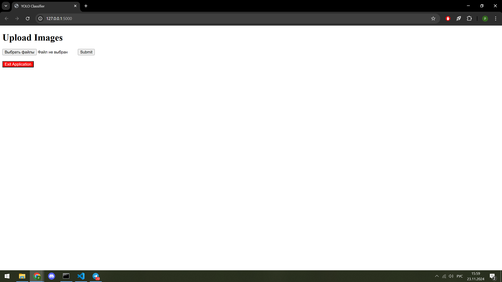
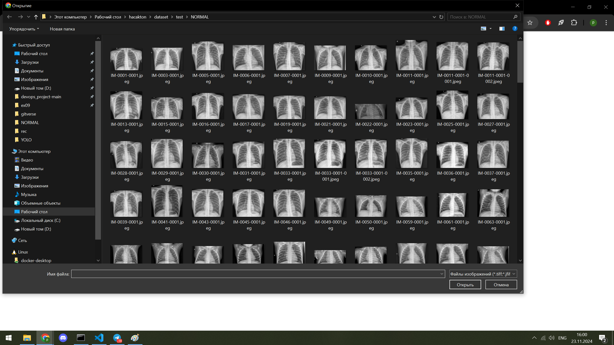
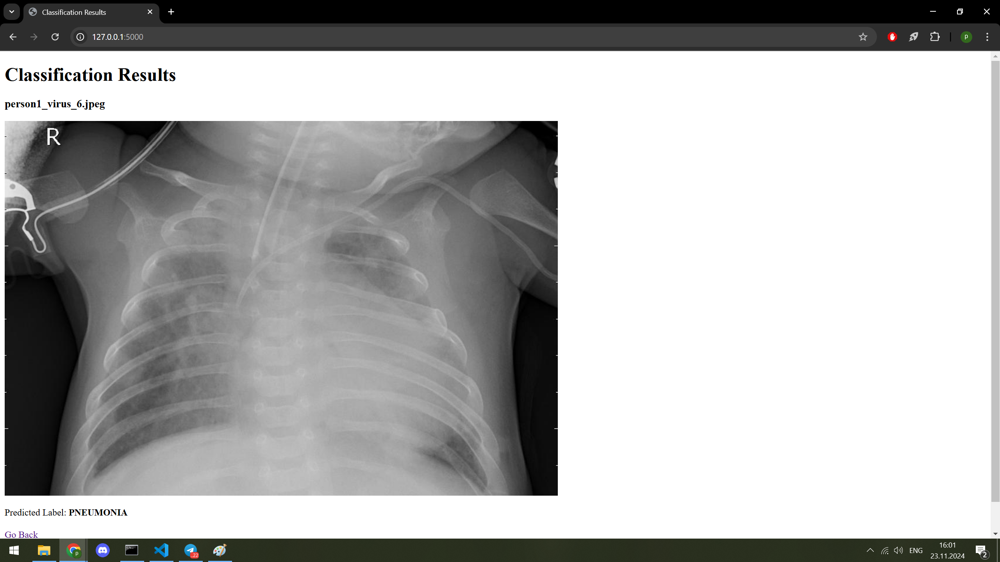
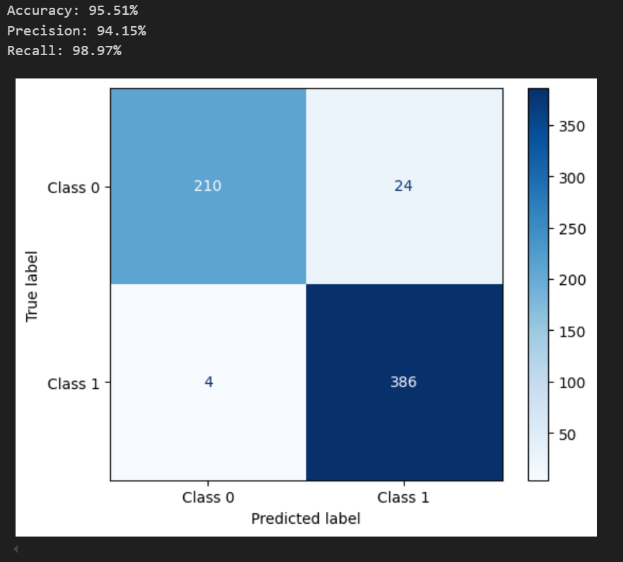

В данном репозитории находится решение для задачи классификации рентгеновских снимков легких представленное в виде web-приложения на Flask.
Для запуска приложения необходимо выполнить в командной строке команду python3 app.py и перейти по адресу

Интерфейс приложения:

Выбор изображений:

Результат работы приложения:

Также в репозитории лежит ноутбук YOLO_and_EN_comparison.ipynb в котором показана работа EfficientNet и YOLO cls на тестовом датасете Chest X-Ray Images (Pneumonia). В результате исследования YOLO показала себя лучше

Метрики:

Датасет лежит по пути app/data/dataset